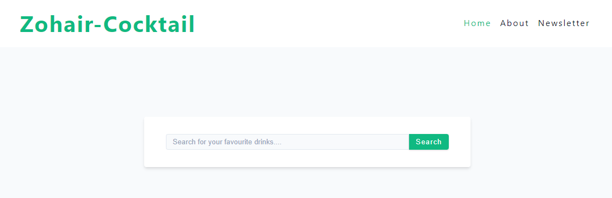
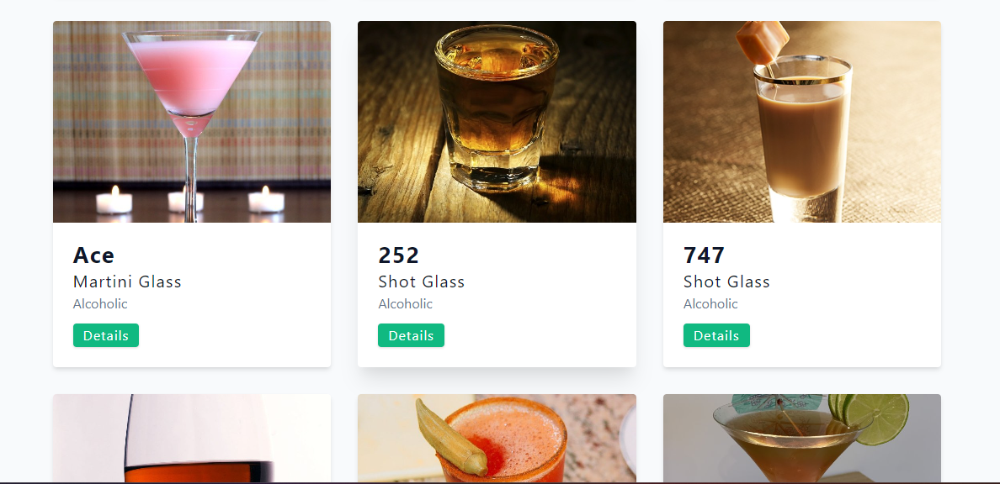
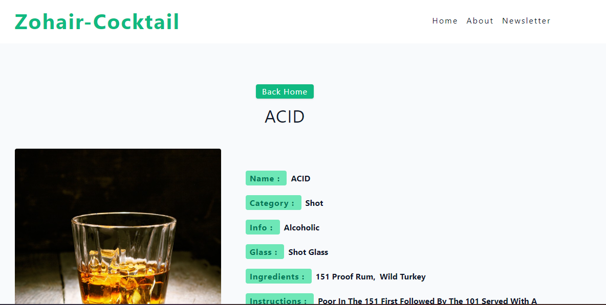
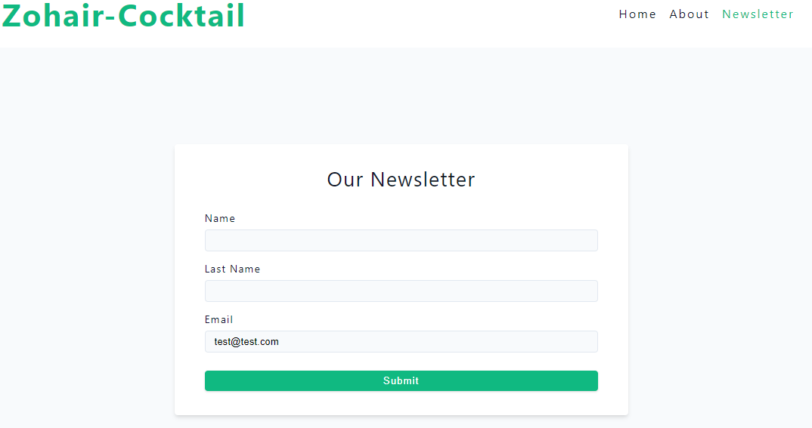

# ALx-zohair-Cocktail

## Description
"ALx-zohair-Cocktail" is the ultimate party sidekick app that fetches cocktails from the hilarious Cocktails DB API. With a flick of your finger, you'll unlock a treasure trove of enchanting drink recipes that'll make your taste buds dance and your friends jump with joy. Get ready to shake up your mixology game, one fantastical mocktail at a time, and let the laughter and giggles flow!

## Technologies Used
- **React.js**: For building the user interface with reusable components.
- **HTML**: For structuring the web pages.
- **CSS**: For styling the application.
- **Bootstrap**: For responsive design and layout.
- **Cocktails DB API**: For fetching cocktail recipes.

## Installation and Setup
To run this project locally, follow these steps:

1. **Clone the repository:**
    git clone https://github.com/ZouhairSA/alx-portfolio-Cocktail.git
2. **2**
    cd ALx-zohair-Cocktail
2. **3**
    npm install
2. **4**
    npm start

## Visualize the Project
    https://alx-portfolio-cocktail.vercel.app/

## Picture
1. **P1**

2. **P2**

3. **P3**

4. **P4**
